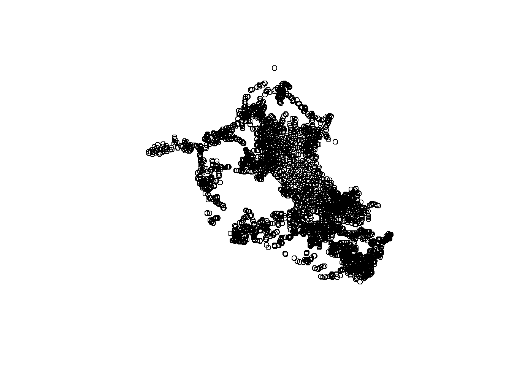

## Loading packages
```{r message=FALSE, warning=FALSE}
pkg <- c("sf", "stringr", "geobr", "readxl", "dplyr", "mpspline2", "tidyr", "terra")

sapply(pkg, require, character.only = T)
```


## Cleaning the environment (removing objects and previously loaded packages)
```{r}
rm(list = ls())  
gc()
```


## Loading the dataset
```{r message=FALSE, warning=FALSE}
df33 <- read_excel("./data/ctb0033.xlsx",
                   sheet = "camada") %>% 
  dplyr::select(1:2, 5:SIO2, -TIO2, -FCH, -densidade_particula_xxx,
                -`0...26`, -`0...21`)

head(df33)

coord_33 <- read_excel("./data/ctb0033.xlsx",
                       sheet = "observacao") %>% 
  dplyr::select(observacao_id, coord_x, coord_y)

head(coord_33)


df33 <- df33 %>% 
  left_join(coord_33, by = "observacao_id") %>% 
  filter(!is.na(coord_y)) %>% 
  dplyr::select(-S, -MO, -FE203, -AL2O3, -SIO2)


head(df33)
```

## Removing depth inconsistencies 
```{r message=FALSE, warning=FALSE}
df_atr <- df33 %>% 
  dplyr::select(observacao_id, camada_id, profund_sup, profund_inf,
                ph_h2o_25_eletrodo, coord_x, coord_y) %>% 
  mutate(t_depht = ifelse(profund_sup > profund_inf, profund_inf,
                          profund_sup),
         b_depht = ifelse(profund_inf < profund_sup, profund_sup,
                          profund_inf)) %>% 
  arrange(observacao_id) %>% 
  mutate(observacao_id = as.factor(observacao_id),
         teste = ifelse(b_depht - t_depht > 0, "ok", NA)) %>% 
  drop_na(teste) %>% 
  select(-teste)

head(df_atr)
```

## Applying the spline
```{r message=FALSE, warning=FALSE}
source("./scripts/s_fspline.R")


l_spl <- spl(obj = df_atr,
             id = "observacao_id",
             upper_limit = "t_depht",
             lower_limit = "b_depht",
             var_name = "ph_h2o_25_eletrodo",
             lam = 0.1,
             d = c(0, 20),
             vlow = 0,
             vhigh = 1000) %>% 
  rename("ph_h2o_25_eletrodo" = "X000_020_cm")


head(l_spl)
```


## Joining the coordinates and transforming them into spatial data
```{r message=FALSE, warning=FALSE}
sf_spl <- l_spl %>% 
  left_join(select(df_atr %>% distinct(observacao_id, .keep_all = T), observacao_id, coord_x, coord_y),
            by = c("profile" = "observacao_id")) %>% 
  select(-profile) %>% 
  st_as_sf(coords = c("coord_x", "coord_y"), crs = "EPSG:4326") %>% 
  st_transform(crs = "ESRI:102015")

hist(sf_spl$ph_h2o_25_eletrodo, xlab = "pH", main = "histogram of pH")
```

<p align="center">

</p>

```{r message=FALSE, warning=FALSE}
plot(st_geometry(sf_spl))
```

<p align="center">

</p>

## Clipping to study area and saving to spatial data
```{r message=FALSE, warning=FALSE}
vj <- st_read("./vect/ro_territorio.shp") %>% 
  st_transform(crs = "ESRI:102015") %>% 
  group_by(territr) %>% 
  summarize() %>% 
  filter(territr == "Vale do Jamari")
```


```{r message=FALSE, warning=FALSE}
plot(st_geometry(vj))
```


<p align="center">

</p>


```{r message=FALSE, warning=FALSE}
atr_filter <- st_intersection(sf_spl, vj) %>% 
  select(-territr)

hist(atr_filter$ph_h2o_25_eletrodo, xlab = "pH", main = "histogram of pH")
```

<p align="center">

</p>

```{r message=FALSE, warning=FALSE}
plot(st_geometry(atr_filter)) 
```

<p align="center">

</p>

```{r message=FALSE, warning=FALSE}
st_write(atr_filter, dsn = "./vect/spline_ph_h2o.gpkg", append = F)
```


## Loading spatial data of soil classes
```{r message=FALSE, warning=FALSE}

vars_y_sf <- st_read("./vect/clas_jamari.gpkg") %>% 
  rename(st_orig = ST_class,
         st_2ord = ST_2ordem,
         st_1ord = ST_ordem,
         st_reag = ST_grupos) %>% 
  select(st_orig, st_2ord, st_1ord, st_reag) %>% 
  mutate(st_orig = tolower(st_orig),
         st_2ord = tolower(st_2ord),
         st_1ord = tolower(st_1ord),
         st_reag = tolower(st_reag)) %>% 
  mutate(st_orig = gsub(x = st_orig, pattern = " ", replacement = "_"),
         st_2ord = gsub(x = st_2ord, pattern = " ", replacement = "_"),
         st_1ord = gsub(x = st_1ord, pattern = " ", replacement = "_"),
         st_reag = gsub(x = st_reag, pattern = " ", replacement = "_"))

head(vars_y_sf)
```

## Grouping rare classes
```{r message=FALSE, warning=FALSE}
v1 <- vars_y_sf %>% as.data.frame() %>% 
  count(st_orig) %>% 
  arrange(n) %>% 
  filter(n == 1) %>% 
  select(1) %>% pull()

print(v1)


for (i in seq_along(v1)) {
  
  vars_y_sf <- vars_y_sf %>% 
    mutate(st_orig = recode(st_orig,
                            !!v1[i] := "other"))
  
}

par(mar = c(10, 5, 3, 3))
vars_y_sf %>% as.data.frame() %>% 
  select(st_orig) %>% 
   table() %>% 
  barplot(ylab = "Frequency", las = 2)
```

<p align="center">

</p>

```{r message=FALSE, warning=FALSE}
v2 <- vars_y_sf %>% as.data.frame() %>% 
  count(st_2ord) %>% 
  arrange(n) %>% 
  filter(n == 1) %>% 
  select(1) %>% pull() %>% print()


for (i in seq_along(v2)) {
  
  vars_y_sf <- vars_y_sf %>% 
    mutate(st_2ord = recode(st_2ord,
                            !!v2[i] := "other"))
  
}


vars_y_sf %>% as.data.frame() %>% 
  select(st_2ord) %>% 
   table() %>% 
  barplot( ylab = "Frequency", las = 2)
```

<p align="center">

</p>

```{r message=FALSE, warning=FALSE}
vars_y_sf <- vars_y_sf %>% 
  mutate(st_2ord = recode(st_2ord,
                          aquox = "other",
                          psamment = "other",
                          tropept = "other",
                          orthent = "other",
                          udox = "other",
                          ustox = "other"))%>% 
  dplyr::select(st_2ord)
```


## Counting number of samples per class and saving the spatial data
```{r message=FALSE, warning=FALSE}
vars_y_sf %>% as.data.frame() %>% 
  count(st_2ord) %>% 
  arrange(n) %>% print()


vars_y_sf %>% as.data.frame() %>% 
  select(st_2ord) %>% 
   table() %>% 
  barplot(ylab = "Frequency", las = 2)
```

<p align="center">

</p>

```{r message=FALSE, warning=FALSE}
par(mar = c(3, 3, 3, 9))
plot(vars_y_sf["st_2ord"], main = "")
plot(st_geometry(vj), add = T)
```

<p align="center">

</p>

```{r message=FALSE, warning=FALSE}
st_write(vars_y_sf, dsn = "./vect/soil_clas.gpkg", append = F)
```
